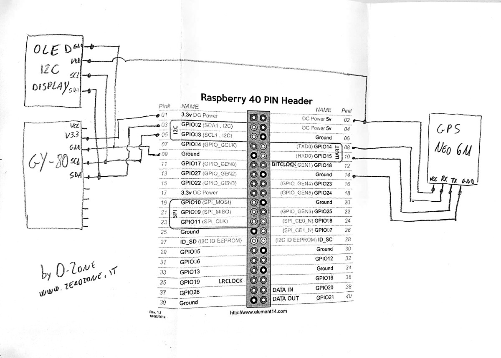
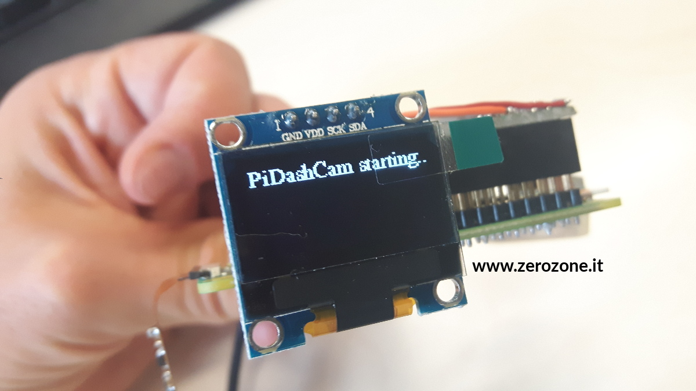
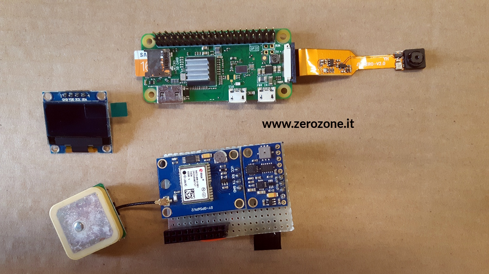
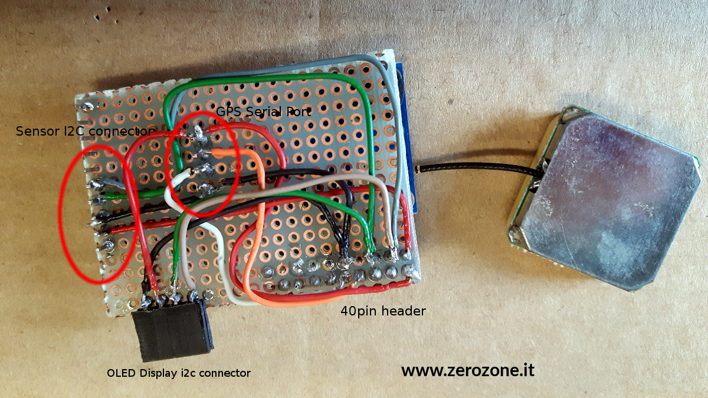

# PiDashCam
Raspberry Pi Zero W dash camera for your auto

## BoM - Bill of Materials

* [Raspberry Pi Zero W](https://www.raspberrypi.org/products/raspberry-pi-zero-w/)
* [Smart Electronics 0.96 White 0.96 Inch OLED Module 128X64 OLED LCD Display Module 0.96 IIC I2C Communicate for arduino Diy Kit](https://www.aliexpress.com/item/Yellow-blue-double-color-and-white-128X64-0-96-inch-OLED-LCD-LED-Display-Module-For/32596867613.html)
* [Raspberry Pi Zero \ Zero W V1.3 Mini Camera 5MP 720P / 1080P Mini Camera Module for Raspberry Pi Zero](https://www.aliexpress.com/item/Raspberry-Pi-Zero-Zero-W-V1-3-Mini-Camera-5MP-720P-1080P-Mini-Camera-Module-for/32810927440.html)
* [Ublox-NEO-6M-GPS-Module](https://it.aliexpress.com/item/Free-Shipping-Ublox-NEO-6M-GPS-Module-with-EEPROM-for-MWC-AeroQuad-with-Antenna-for-Flight/32391262594.html)
* [GY-80 - Multi Sensor Board - 3 Axis Gyro -3 Axis Accelerometer - 3 Axis Magnetometer - Barometer - Thermometer](http://selfbuilt.net/shop/gy-80-inertial-management-unit)

Soldering iron, board, wires and all other stuff needed to build a simple circuit...

## Schematic

## How first prototype looks like...

